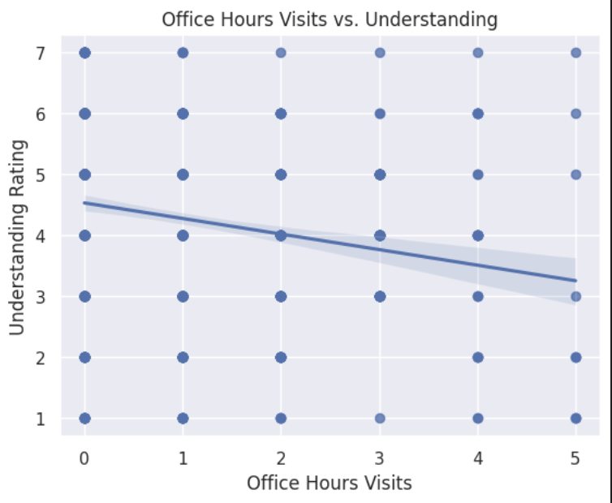
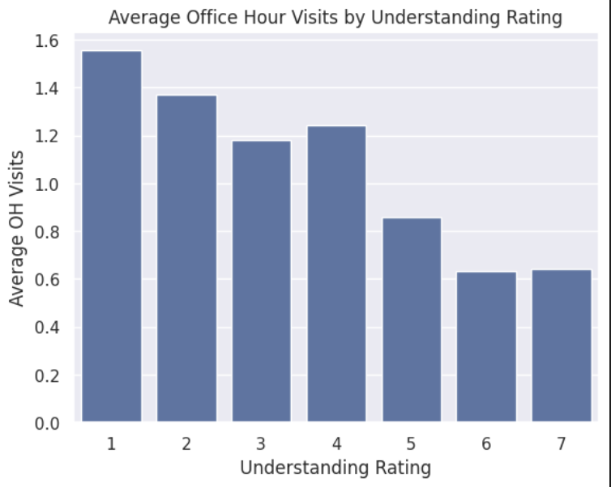
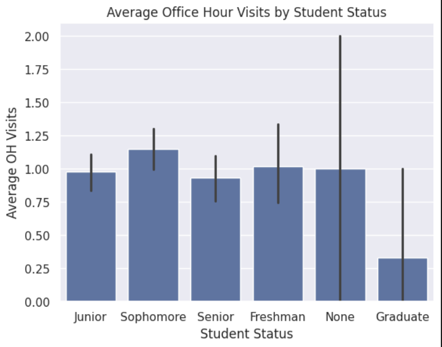
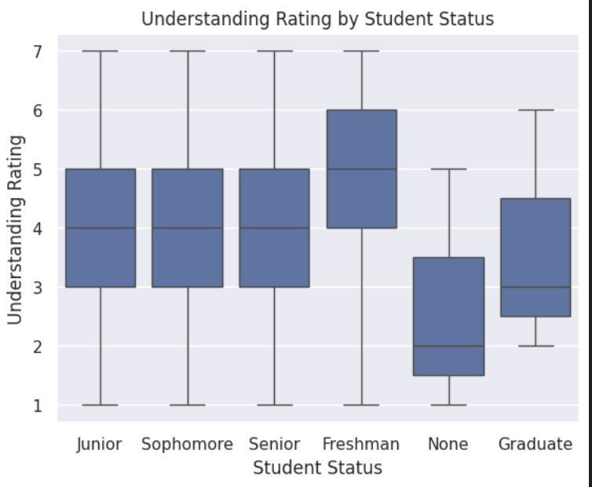

---
# Do not edit the text between these lines!
layout: default
---

# Comp 110 Coding Assignment 9

<!-- This is a comment. Below, you'll see code for inserting an image. To make this image appear, update <custom-path>. To add an image, save it inside the imgs folder of this repository. -->

## Research Question

We have decided to analyze how office hours visits relate to percieved understanding of course content. This is valuble because office hours is one of the most available resources for students, and understanding how beneficial they are could provide reason for the instructional team to further incentivize office hours visit.

## Analysis 

The regression line showing the relationship between Office Hours Visits and Understanding Rating slopes down, suggesting students who percieve themselves as understanding the content less visit office hours more. This is a positive sign, as it means struggling students are making use of their resources.

Students who reported lower understanding make more use of office hours.

The number of office hours visits averaged by students of each class year are pretty consistant, suggesting most people who reported attending office hours went about once per assignment.

There is no clear trend in how class impacts understanding, except for freshman reporting higher understanding. This could be because students who intend to major in computer science would take the class earlier on in their education and perform better, or potentially because freshmen tend to have lighter courseloads.

## Conclusion

We asked if the course should incentivize office hours more to increase student understanding, and this was not supported much by the data. The sample size of students that reported actually attending office hours was not very high and the group skewed towards people with lower percieved understanding. More analysis of other responses would be needed. The most helpful metric here may be comparing class performance of students who report the same percieved understanding score who attended office hours with those who did not attend office hours. This analysis could be taken another step if the number of office hours visits is also taken into account. 

The total amount of students who reported attending office hours is overall pretty low, which could potentially be considered reason enough for the instructional team to incentivize attendance for the students. 